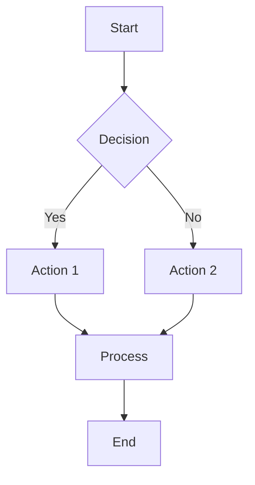
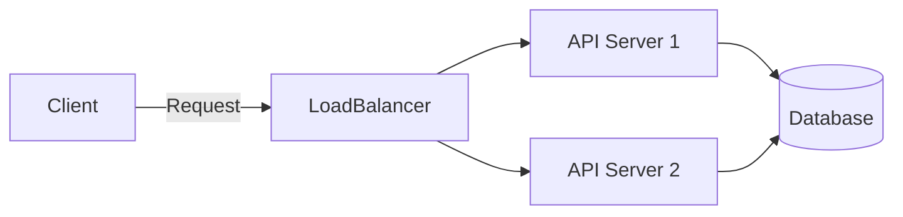
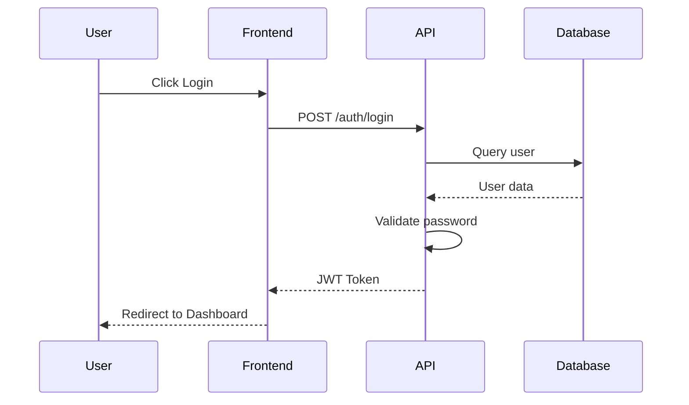
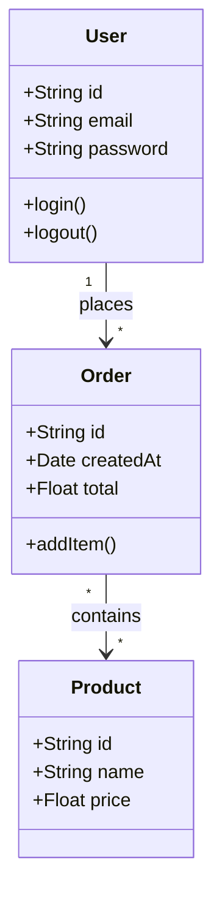
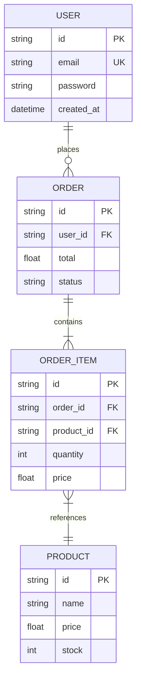
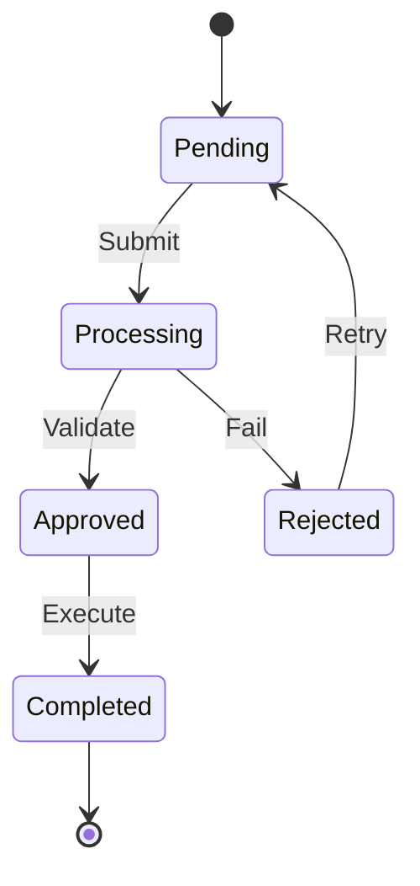
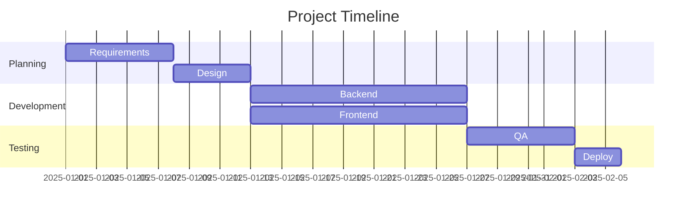
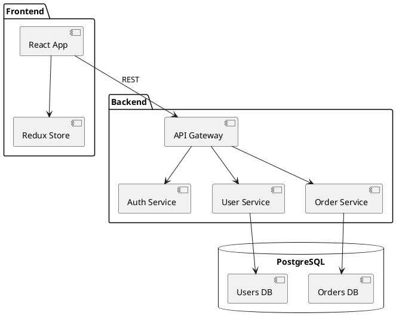
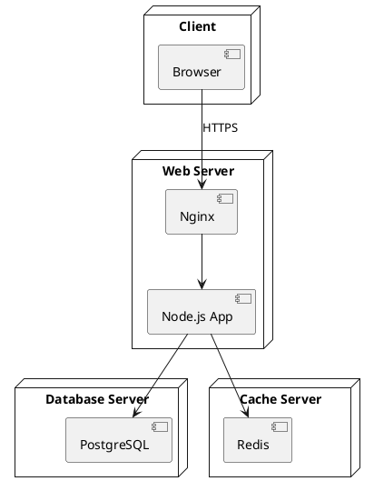

# Diagram Generation

Generate professional diagrams, flowcharts, and visualizations compatible with Eraser.io and other tools.

## Supported Formats

| Format | Best For | Tools |
|--------|----------|-------|
| **Mermaid** | Flowcharts, sequences, Gantt | Eraser.io, GitHub, Notion |
| **D2** | Architecture, infrastructure | Eraser.io, D2 playground |
| **PlantUML** | UML diagrams | PlantUML server |
| **ASCII** | Quick docs, markdown | Any text editor |

## Mermaid Diagrams

### Flowchart




### Sequence Diagram


### Class Diagram


### Entity Relationship


### State Diagram


### Gantt Chart


## D2 Diagrams

### System Architecture
```d2
direction: right

User: {
  shape: person
}

LoadBalancer: {
  shape: hexagon
}

API: {
  shape: rectangle
  style.fill: "#E3F2FD"
}

Database: {
  shape: cylinder
  style.fill: "#FFF3E0"
}

Cache: {
  shape: queue
  style.fill: "#E8F5E9"
}

User -> LoadBalancer: HTTPS
LoadBalancer -> API: Route
API -> Database: Query
API -> Cache: Get/Set
```

### Microservices Architecture
```d2
Client: {
  shape: person
}

Gateway: API Gateway {
  style.fill: "#E1BEE7"
}

Services: {
  Auth: {
    shape: rectangle
    style.fill: "#BBDEFB"
  }
  Users: {
    shape: rectangle
    style.fill: "#BBDEFB"
  }
  Orders: {
    shape: rectangle
    style.fill: "#BBDEFB"
  }
}

Queue: Message Queue {
  shape: queue
}

Client -> Gateway: REST/GraphQL
Gateway -> Services.Auth: Authenticate
Gateway -> Services.Users: User ops
Gateway -> Services.Orders: Order ops
Services.Orders -> Queue: Events
```

### Cloud Infrastructure
```d2
Cloud: AWS {
  VPC: {
    style.fill: "#F5F5F5"
    
    Public: Public Subnet {
      ALB: Application Load Balancer
      Bastion: Bastion Host
    }
    
    Private: Private Subnet {
      EC2_1: EC2 Instance 1
      EC2_2: EC2 Instance 2
    }
    
    Data: Data Layer {
      RDS: PostgreSQL RDS
      ElastiCache: Redis Cluster
    }
  }
}

Users: {
  shape: person
}

Users -> Cloud.VPC.Public.ALB: HTTPS
Cloud.VPC.Public.ALB -> Cloud.VPC.Private.EC2_1
Cloud.VPC.Public.ALB -> Cloud.VPC.Private.EC2_2
Cloud.VPC.Private.EC2_1 -> Cloud.VPC.Data.RDS
Cloud.VPC.Private.EC2_1 -> Cloud.VPC.Data.ElastiCache
```

## PlantUML Diagrams

### Component Diagram


### Deployment Diagram


## ASCII Diagrams

### Simple Flow
```
┌─────────┐     ┌─────────┐     ┌─────────┐
│  Input  │────▶│ Process │────▶│  Output │
└─────────┘     └─────────┘     └─────────┘
```

### Architecture
```
┌─────────────────────────────────────────────────┐
│                    Client                        │
│  ┌──────────┐  ┌──────────┐  ┌──────────┐      │
│  │ Browser  │  │  Mobile  │  │   CLI    │      │
│  └────┬─────┘  └────┬─────┘  └────┬─────┘      │
└───────┼─────────────┼─────────────┼─────────────┘
        │             │             │
        └─────────────┼─────────────┘
                      ▼
              ┌───────────────┐
              │  Load Balancer│
              └───────┬───────┘
                      │
        ┌─────────────┼─────────────┐
        ▼             ▼             ▼
  ┌──────────┐  ┌──────────┐  ┌──────────┐
  │ Server 1 │  │ Server 2 │  │ Server 3 │
  └────┬─────┘  └────┬─────┘  └────┬─────┘
       │             │             │
       └─────────────┼─────────────┘
                     ▼
             ┌───────────────┐
             │   Database    │
             └───────────────┘
```

### Decision Tree
```
                    ┌──────────────┐
                    │   Start      │
                    └──────┬───────┘
                           │
                    ┌──────▼───────┐
                    │  Condition?  │
                    └──────┬───────┘
                    ┌──────┴──────┐
                    │             │
               ┌────▼────┐   ┌────▼────┐
               │  Yes    │   │   No    │
               └────┬────┘   └────┬────┘
                    │             │
               ┌────▼────┐   ┌────▼────┐
               │Action A │   │Action B │
               └────┬────┘   └────┬────┘
                    │             │
                    └──────┬──────┘
                           │
                    ┌──────▼───────┐
                    │    End       │
                    └──────────────┘
```

## Diagram Selection Guide

| Use Case | Best Format | Example |
|----------|-------------|---------|
| User flow | Mermaid flowchart | Login/signup flow |
| API interactions | Mermaid sequence | Request/response |
| Database schema | Mermaid ERD | Data model |
| System architecture | D2 | Microservices |
| Infrastructure | D2 | Cloud resources |
| Code structure | PlantUML class | OOP design |
| Timeline | Mermaid Gantt | Project plan |
| Quick docs | ASCII | README |

## Eraser.io Integration

### Using in Eraser.io
1. Copy Mermaid or D2 code
2. Paste into Eraser.io editor
3. Customize colors and styling
4. Export as PNG/SVG or embed

### Best Practices for Eraser.io
- Use D2 for complex architecture
- Use Mermaid for simple diagrams
- Apply consistent color schemes
- Add labels and descriptions
- Group related components

## Color Schemes

### Mermaid
```mermaid
%%{init: {'theme': 'base', 'themeVariables': {
  'primaryColor': '#2563EB',
  'primaryTextColor': '#FFFFFF',
  'primaryBorderColor': '#1E40AF',
  'lineColor': '#64748B',
  'secondaryColor': '#F1F5F9',
  'tertiaryColor': '#E2E8F0'
}}}%%
```

### D2
```d2
style: {
  fill: "#E3F2FD"
  stroke: "#1976D2"
  font-color: "#1A237E"
}
```

## Best Practices

### Do's
- Keep diagrams simple and focused
- Use consistent shapes and colors
- Add clear labels
- Show relationships with arrows
- Include legends for complex diagrams

### Don'ts
- Overcrowd with too many elements
- Use inconsistent styling
- Skip connection labels
- Ignore direction/flow
- Forget to update when system changes
