# Mermaid Diagrams

Comprehensive guide to creating professional diagrams using Mermaid.js syntax. Generate flowcharts, sequence diagrams, ERDs, Gantt charts, timelines, state diagrams, and more.

## Overview

- **Purpose:** Create text-based diagrams that render visually in Markdown, documentation, and web applications
- **Scope:** All Mermaid.js diagram types with syntax examples and best practices
- **Audience:** Developers, architects, project managers, technical writers

## When to Use

Use this skill when:
- Documenting system architecture and flows
- Creating API sequence diagrams
- Designing database schemas (ERDs)
- Planning project timelines (Gantt charts)
- Visualizing state machines
- Creating user journey maps
- Generating diagrams in Markdown/GitHub/Notion

## Supported Platforms

| Platform | Support | Notes |
|----------|---------|-------|
| GitHub | ✅ Native | Renders in README, issues, PRs |
| GitLab | ✅ Native | Full support |
| Notion | ✅ Native | Use `/mermaid` command |
| VS Code | ✅ Extension | Mermaid preview extensions |
| Eraser.io | ✅ Native | Copy/paste Mermaid code |
| Confluence | ✅ Plugin | Mermaid plugin required |
| Slack | ⚠️ Limited | Via app integration |

---

## Diagram Types

### 1. Flowchart

Best for: Process flows, decision trees, system architecture

#### Direction Options
- `TB` or `TD` - Top to Bottom
- `BT` - Bottom to Top
- `LR` - Left to Right
- `RL` - Right to Left

#### Node Shapes

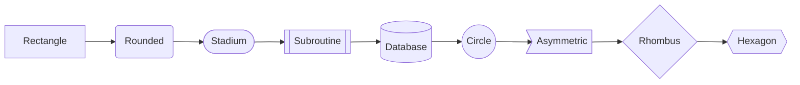

**Syntax:**
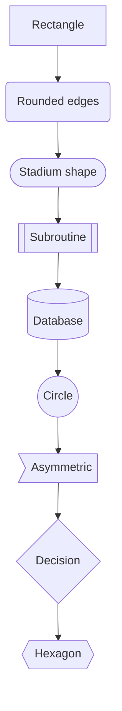

#### Connection Types

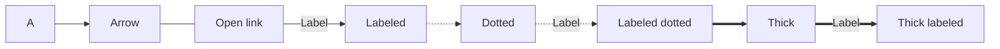

**Syntax:**
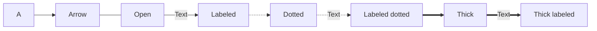

#### Subgraphs

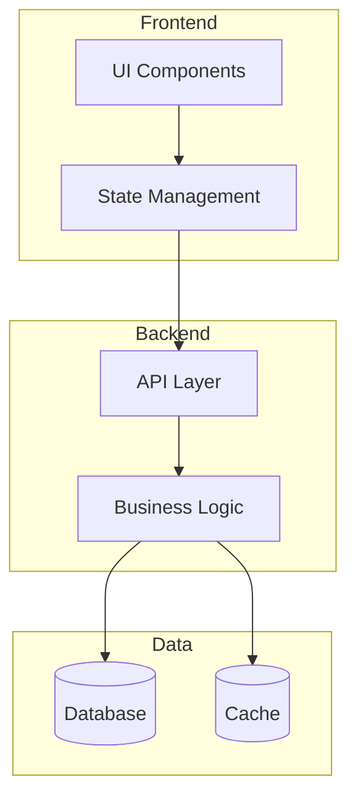

**Syntax:**
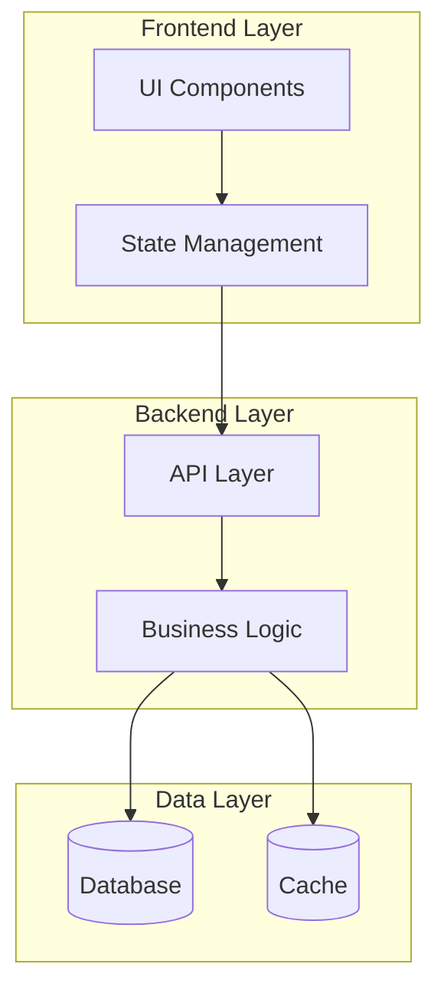

#### Decision Flow Example

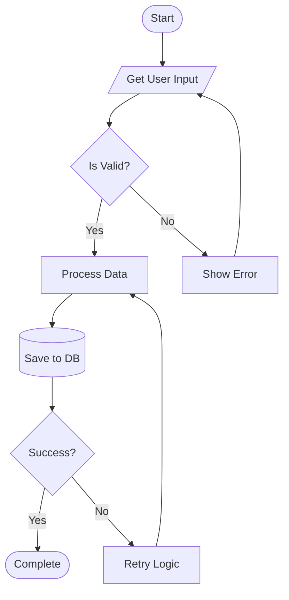

---

### 2. Sequence Diagram

Best for: API interactions, service communication, authentication flows

#### Basic Syntax

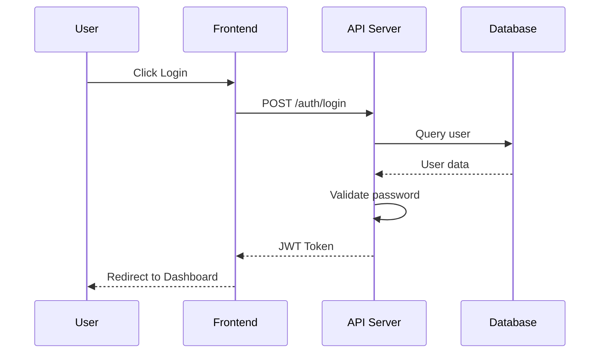

**Syntax:**
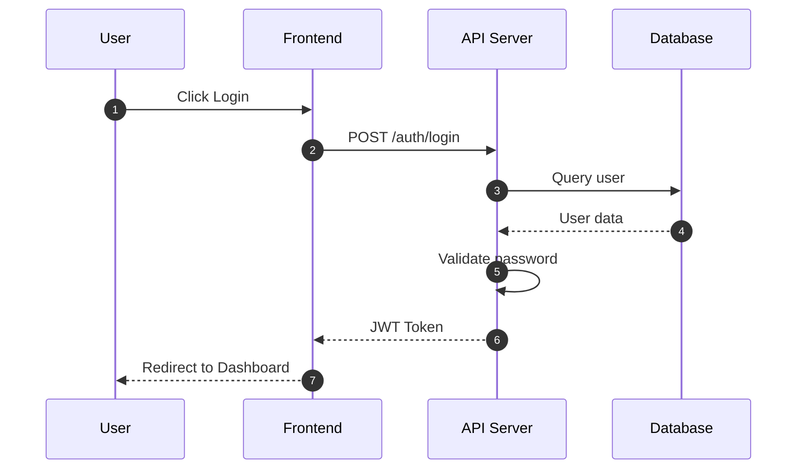

#### Arrow Types

| Arrow | Syntax | Description |
|-------|--------|-------------|
| `->` | Solid without arrow | Message |
| `->>` | Solid with arrow | Request |
| `-->>` | Dotted with arrow | Response |
| `--)` | Dotted open | Async |
| `->+` | Activation | Start lifeline |
| `-->-` | Deactivation | End lifeline |
| `->>` | Solid arrow | Sync call |

#### Activation Bars

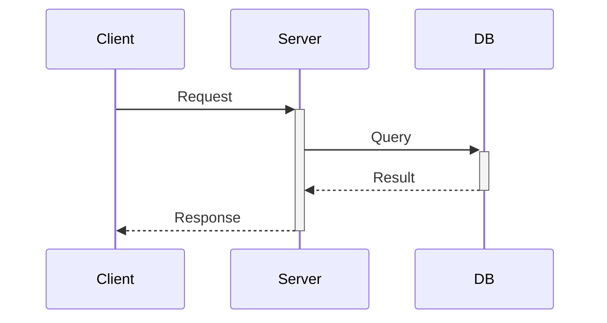

**Syntax:**


#### Loops and Conditionals

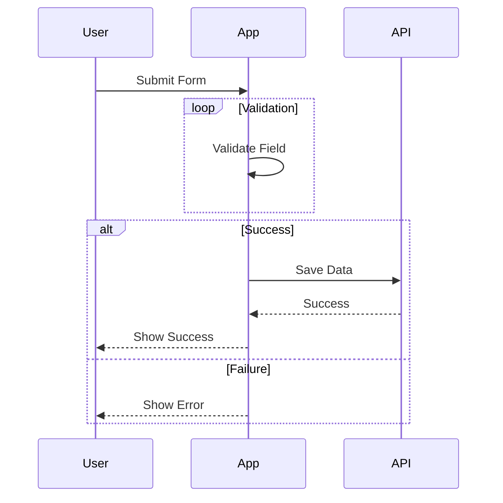

**Syntax:**


#### OAuth2 Flow Example

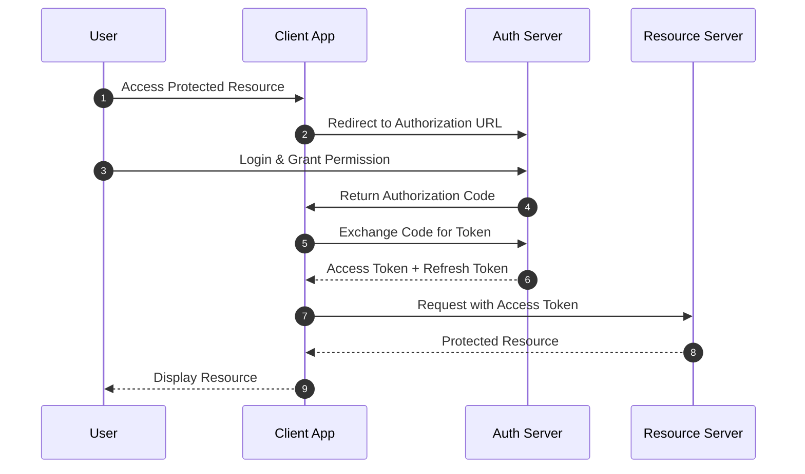

---

### 3. Entity Relationship Diagram (ERD)

Best for: Database schema design, data modeling

#### Basic Syntax

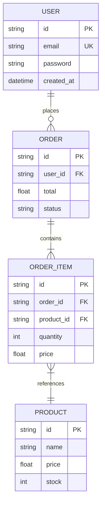

#### Relationship Notation

| Symbol | Meaning |
|--------|---------|
| `||--||` | One to One |
| `||--o{` | One to Many (zero or more) |
| `||--|{` | One to Many (one or more) |
| `}o--o{` | Many to Many |
| `}o--||` | Many to One |

#### Complete E-commerce ERD

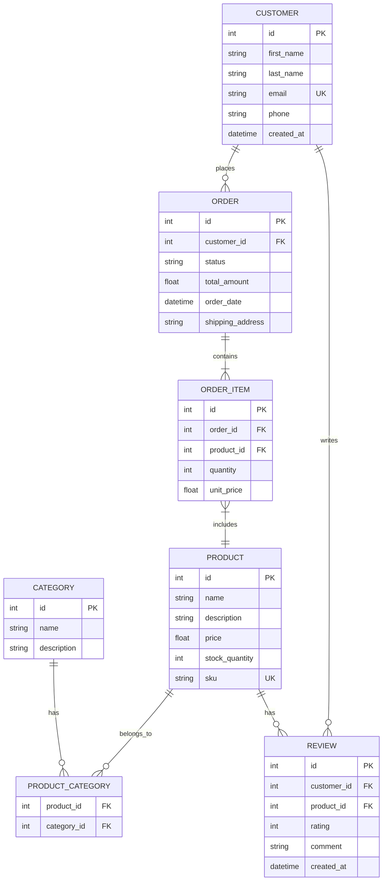

#### Key Annotations

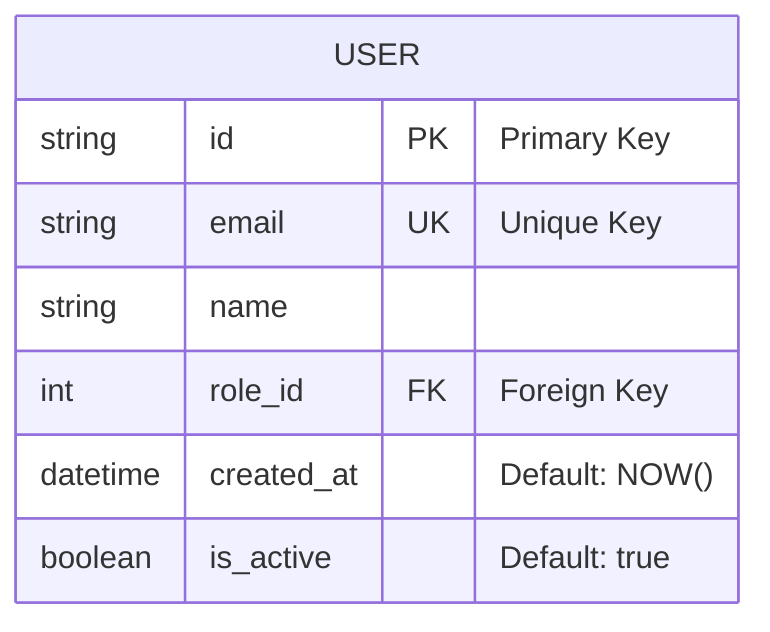

---

### 4. Gantt Chart

Best for: Project planning, timeline visualization, sprint planning

#### Basic Syntax

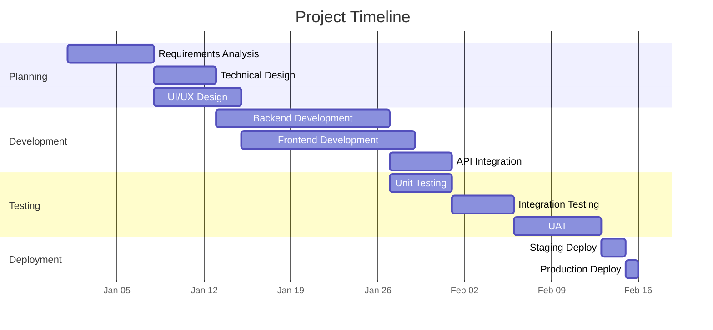

#### Task Status

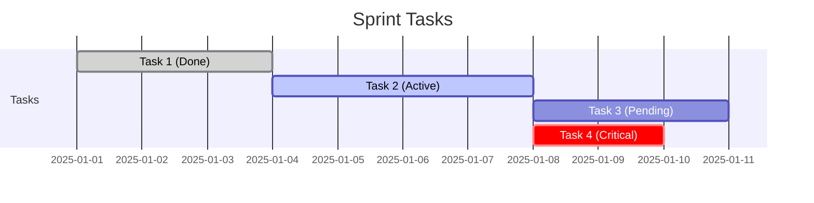

#### Milestones

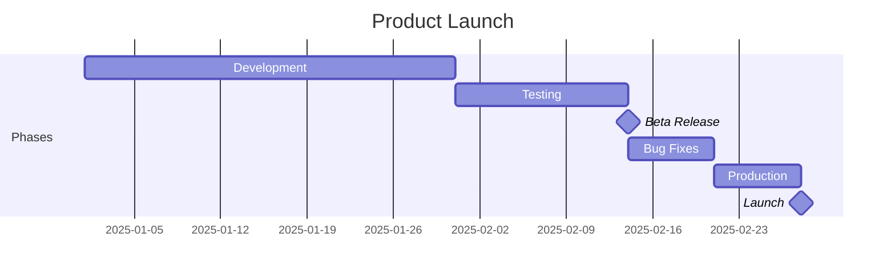

#### Multiple Sections

```mermaid
gantt
    title Q1 2025 Development Plan
    dateFormat  YYYY-MM-DD
    
    section Frontend Team
    React Components     :fc, 2025-01-06, 14d
    State Management     :sm, after fc, 7d
    UI Polish           :ui, after sm, 5d
    
    section Backend Team
    API Development      :api, 2025-01-06, 21d
    Database Design     :db, 2025-01-06, 7d
    Authentication      :auth, after db, 7d
    
    section DevOps
    CI/CD Pipeline      :cicd, 2025-01-13, 5d
    Infrastructure      :infra, after cicd, 7d
    Monitoring          :mon, after infra, 5d
    
    section QA
    Test Planning       :tp, 2025-01-20, 5d
    Test Execution      :te, after tp, 14d
    UAT                 :uat, after te, 7d
```

---

### 5. Timeline

Best for: Historical events, project history, release notes

#### Basic Timeline

```mermaid
timeline
    title Software Development History
    1970 : Unix Created
    1983 : C++ Released
    1991 : Linux Kernel
         : Python Released
    1995 : Java Released
         : JavaScript Created
    2009 : Node.js Released
         : Go Released
    2012 : TypeScript Announced
    2014 : Docker 1.0
    2022 : ChatGPT Launch
```

#### Grouped Timeline

```mermaid
timeline
    title Product Roadmap 2025
    section Q1
        Jan : MVP Launch
        Feb : User Feedback Integration
        Mar : Performance Optimization
    section Q2
        Apr : Mobile App Beta
        May : Payment Integration
        Jun : Analytics Dashboard
    section Q3
        Jul : Enterprise Features
        Aug : API v2 Release
        Sep : International Launch
    section Q4
        Oct : AI Features
        Nov : Platform Integrations
        Dec : Year-end Review
```

#### Release History

```mermaid
timeline
    title API Version History
    section v1.x
        v1.0 : Initial Release
             : Basic CRUD Operations
        v1.5 : Authentication Added
             : Rate Limiting
    section v2.x
        v2.0 : GraphQL Support
             : Webhook System
        v2.1 : Batch Operations
        v2.5 : Real-time Subscriptions
    section v3.x
        v3.0 : Complete Rewrite
             : TypeScript SDK
        v3.2 : Edge Computing Support
```

---

### 6. State Diagram

Best for: Workflow states, order status, state machines

#### Basic Syntax

```mermaid
stateDiagram-v2
    [*] --> Draft
    Draft --> Review : Submit
    Review --> Approved : Accept
    Review --> Draft : Reject
    Approved --> Published : Publish
    Published --> Archived : Archive
    Archived --> [*]
```

#### Composite States

```mermaid
stateDiagram-v2
    [*] --> Idle
    
    state "Processing Order" as Processing {
        [*] --> Validating
        Validating --> PaymentPending : Valid
        Validating --> [*] : Invalid
        PaymentPending --> PaymentProcessing : Pay
        PaymentProcessing --> PaymentSuccess : Success
        PaymentProcessing --> PaymentFailed : Failed
        PaymentFailed --> PaymentPending : Retry
        PaymentSuccess --> [*]
    }
    
    Idle --> Processing : Place Order
    Processing --> Shipped : Complete
    Shipped --> Delivered : Ship
    Delivered --> [*]
```

#### Order Status Example

```mermaid
stateDiagram-v2
    [*] --> Pending
    
    Pending --> Processing : Payment Received
    Pending --> Cancelled : Cancel
    
    Processing --> QualityCheck : Items Picked
    Processing --> OnHold : Stock Issue
    
    OnHold --> Processing : Stock Available
    OnHold --> Cancelled : Timeout
    
    QualityCheck --> Shipped : Pass
    QualityCheck --> Processing : Fail
    
    Shipped --> InTransit : Carrier Pickup
    InTransit --> Delivered : Delivery Complete
    InTransit --> Returned : Return Requested
    
    Delivered --> [*]
    Cancelled --> [*]
    Returned --> [*]
```

#### Concurrent States

```mermaid
stateDiagram-v2
    [*] --> Active
    
    state Active {
        state "Reader Mode" as Reader
        state "Writer Mode" as Writer
        --
        state "Online" as Online
        state "Offline" as Offline
    }
    
    Active --> Inactive : Logout
    Inactive --> [*]
```

---

### 7. Class Diagram

Best for: OOP design, domain modeling, code architecture

#### Basic Syntax

```mermaid
classDiagram
    class Animal {
        +String name
        +int age
        +makeSound() void
    }
    
    class Dog {
        +String breed
        +bark() void
        +fetch() void
    }
    
    class Cat {
        +boolean indoor
        +meow() void
        +scratch() void
    }
    
    Animal <|-- Dog
    Animal <|-- Cat
```

#### Visibility Modifiers

| Symbol | Visibility |
|--------|------------|
| `+` | Public |
| `-` | Private |
| `#` | Protected |
| `~` | Package/Internal |

#### Relationships

```mermaid
classDiagram
    class User {
        +String id
        +String email
        +authenticate() bool
    }
    
    class Order {
        +String id
        +Date createdAt
        +Float total
        +addItem(Item)
    }
    
    class Item {
        +String productId
        +Int quantity
        +Float price
    }
    
    class Product {
        +String id
        +String name
        +Float price
    }
    
    User "1" --> "*" Order : places
    Order "1" *-- "*" Item : contains
    Item "*" --> "1" Product : references
```

#### Relationship Types

| Notation | Relationship | Description |
|----------|--------------|-------------|
| `-->` | Association | Uses/References |
| `--*` | Composition | Owns (strong) |
| `--o` | Aggregation | Has (weak) |
| `--|>` | Inheritance | Extends |
| `--` | Link | Related |
| `..>` | Dependency | Depends on |
| `..|>` | Realization | Implements |

#### Complete Example

```mermaid
classDiagram
    class IAuthService {
        <<interface>>
        +login(email, password) Token
        +logout() void
        +refreshToken(token) Token
    }
    
    class AuthService {
        -UserRepository userRepo
        -TokenService tokenService
        +login(email, password) Token
        +logout() void
        +refreshToken(token) Token
        -validateCredentials() bool
    }
    
    class UserRepository {
        -Database db
        +findById(id) User
        +findByEmail(email) User
        +save(user) void
    }
    
    class User {
        +String id
        +String email
        -String passwordHash
        +verifyPassword(password) bool
    }
    
    class TokenService {
        -String secret
        +generateToken(user) Token
        +validateToken(token) bool
    }
    
    class Token {
        +String accessToken
        +String refreshToken
        +Date expiresAt
    }
    
    IAuthService <|.. AuthService : implements
    AuthService --> UserRepository : uses
    AuthService --> TokenService : uses
    AuthService --> Token : creates
    UserRepository --> User : manages
```

---

### 8. Pie Chart

Best for: Data distribution, market share, resource allocation

```mermaid
pie showData
    title Tech Stack Usage 2025
    "JavaScript" : 35
    "TypeScript" : 30
    "Python" : 20
    "Go" : 10
    "Rust" : 5
```

**Syntax:**
```mermaid
pie showData
    title Browser Market Share
    "Chrome" : 65
    "Safari" : 18
    "Firefox" : 8
    "Edge" : 6
    "Others" : 3
```

---

### 9. Mindmap

Best for: Brainstorming, feature planning, documentation structure

```mermaid
mindmap
    root((Project))
        Frontend
            React
                Components
                Hooks
                Context
            Styling
                Tailwind CSS
                CSS Modules
            State
                Redux
                Zustand
        Backend
            API
                REST
                GraphQL
            Database
                PostgreSQL
                Redis
            Auth
                JWT
                OAuth
        DevOps
            CI/CD
                GitHub Actions
                Jenkins
            Container
                Docker
                Kubernetes
```

---

### 10. User Journey

Best for: UX design, customer experience mapping

```mermaid
journey
    title User Shopping Experience
    section Discovery
      Search product: 5: User
      Browse results: 4: User
      Read reviews: 4: User
    section Consideration
      Compare prices: 3: User
      Add to cart: 5: User
      Continue shopping: 4: User
    section Purchase
      Enter checkout: 4: User
      Payment process: 3: User, System
      Order confirmation: 5: User, System
    section Post-Purchase
      Shipping updates: 4: System
      Delivery: 5: User
      Product review: 4: User
```

---

## Theming & Styling

### Theme Options

```mermaid
%%{init: {'theme': 'base', 'themeVariables': {
    'primaryColor': '#2563EB',
    'primaryTextColor': '#FFFFFF',
    'primaryBorderColor': '#1E40AF',
    'lineColor': '#64748B',
    'secondaryColor': '#F1F5F9',
    'tertiaryColor': '#E2E8F0',
    'fontFamily': 'Inter, sans-serif',
    'fontSize': '16px'
}}}%%

flowchart LR
    A[Styled] --> B[Diagram]
```

### Built-in Themes

| Theme | Best For |
|-------|----------|
| `default` | General use |
| `neutral` | Minimal, professional |
| `dark` | Dark mode apps |
| `forest` | Green-tinted |
| `base` | Custom colors |

### Custom Theme Example

```mermaid
%%{init: {'theme': 'base', 'themeVariables': {
    'primaryColor': '#7C3AED',
    'edgeLabelBackground': '#F5F3FF',
    'tertiaryColor': '#EDE9FE'
}}}%%

flowchart TD
    A[Start] --> B{Decision}
    B -->|Yes| C[Action]
    B -->|No| D[Alternative]
```

---

## Best Practices

### Do's ✅

1. **Keep diagrams focused** - One concept per diagram
2. **Use consistent naming** - PascalCase for nodes, clear labels
3. **Add titles** - Always include a title for context
4. **Use subgraphs** - Group related elements
5. **Label connections** - Add meaningful text to arrows
6. **Validate syntax** - Use Mermaid Live Editor before committing
7. **Use direction wisely** - LR for processes, TD for hierarchies
8. **Add comments** - Document complex logic
9. **Version diagrams** - Keep diagrams updated with code changes
10. **Test rendering** - Verify in target platform before publishing

### Don'ts ❌

1. **Don't overcrowd** - Split complex diagrams
2. **Don't use vague labels** - Be specific
3. **Don't skip direction** - Always specify flow direction
4. **Don't mix styles** - Keep consistent node shapes
5. **Don't ignore layout** - Consider how it renders
6. **Don't forget accessibility** - Add alt text in docs
7. **Don't use long labels** - Keep text concise
8. **Don't nest too deep** - Limit subgraph depth to 3
9. **Don't skip legend** - Add for complex diagrams
10. **Don't hardcode dates** - Use relative dates in Gantt charts

---

## Common Patterns

### Pattern: API Request Flow

```mermaid
sequenceDiagram
    autonumber
    participant C as Client
    participant G as API Gateway
    participant A as Auth Service
    participant S as Service
    participant D as Database
    
    C->>G: Request + Token
    G->>A: Validate Token
    A-->>G: Token Valid
    G->>S: Forward Request
    S->>D: Query Data
    D-->>S: Data
    S-->>G: Response
    G-->>C: Response
```

### Pattern: Microservices Architecture

```mermaid
flowchart TB
    subgraph Client Layer
        Web[Web App]
        Mobile[Mobile App]
    end
    
    subgraph API Layer
        Gateway[API Gateway]
    end
    
    subgraph Services
        Auth[Auth Service]
        User[User Service]
        Order[Order Service]
        Product[Product Service]
    end
    
    subgraph Data Layer
        UserDB[(User DB)]
        OrderDB[(Order DB)]
        ProductDB[(Product DB)]
        Cache[(Redis Cache)]
    end
    
    Web --> Gateway
    Mobile --> Gateway
    Gateway --> Auth
    Gateway --> User
    Gateway --> Order
    Gateway --> Product
    Auth --> Cache
    User --> UserDB
    Order --> OrderDB
    Product --> ProductDB
```

### Pattern: CI/CD Pipeline

```mermaid
flowchart LR
    A[Commit] --> B[Build]
    B --> C{Tests Pass?}
    C -->|Yes| D[Security Scan]
    C -->|No| E[Notify Developer]
    D --> F{Vulnerabilities?}
    F -->|No| G[Deploy Staging]
    F -->|Yes| H[Security Review]
    G --> I[Integration Tests]
    I --> J{Pass?}
    J -->|Yes| K[Deploy Production]
    J -->|No| L[Rollback]
    K --> M[Monitor]
```

### Pattern: Data Model

```mermaid
erDiagram
    TENANT ||--o{ USER : has
    TENANT ||--o{ SUBSCRIPTION : subscribes
    USER ||--o{ ROLE : assigned
    USER ||--o{ SESSION : creates
    ROLE ||--o{ PERMISSION : has
    SUBSCRIPTION ||--|| PLAN : uses
    
    TENANT {
        uuid id PK
        string name
        string domain UK
        jsonb settings
    }
```

---

## Checklist

### Before Creating Diagram

- [ ] Identify the diagram type needed
- [ ] Determine the audience
- [ ] List all elements to include
- [ ] Plan the layout direction

### During Creation

- [ ] Use appropriate diagram type
- [ ] Add title and labels
- [ ] Apply consistent styling
- [ ] Use subgraphs for grouping
- [ ] Label all connections

### After Creation

- [ ] Test in Mermaid Live Editor
- [ ] Verify rendering in target platform
- [ ] Check all connections are correct
- [ ] Validate with stakeholders
- [ ] Add to documentation

---

## Common Issues

### Issue: Diagram Not Rendering

**Symptoms:**
- Blank space where diagram should be
- Raw code displayed instead of diagram

**Solution:**
1. Check for syntax errors (missing brackets, quotes)
2. Verify platform supports Mermaid
3. Use Mermaid Live Editor to validate: https://mermaid.live

### Issue: Layout Issues

**Symptoms:**
- Nodes overlapping
- Lines crossing unnecessarily

**Solution:**
```mermaid
%% Fix by changing direction or using subgraphs
flowchart TB
    %% Use TB for tall diagrams
    %% Use LR for wide diagrams
```

### Issue: Long Labels Breaking Layout

**Symptoms:**
- Text cut off
- Diagram too wide

**Solution:**
```mermaid
flowchart LR
    %% Use line breaks with <br>
    A["Long Label<br>Second Line"] --> B[Short]
```

---

## Quick Reference

### Diagram Types

| Type | Keyword | Best For |
|------|---------|----------|
| Flowchart | `flowchart` | Processes, decisions |
| Sequence | `sequenceDiagram` | API interactions |
| ERD | `erDiagram` | Database schema |
| Gantt | `gantt` | Project timelines |
| Timeline | `timeline` | Historical events |
| State | `stateDiagram-v2` | State machines |
| Class | `classDiagram` | OOP design |
| Pie | `pie` | Data distribution |
| Mindmap | `mindmap` | Brainstorming |
| Journey | `journey` | User experience |

### Common Syntax

```
# Comments
%% This is a comment

# Node shapes
A[Rectangle]
B(Rounded)
C((Circle))
D{Diamond}
E[(Database)]

# Connections
A --> B
A --- B
A -.-> B
A ==> B

# Labels
A -->|Label| B
A -- Text --> B
```

---

## Tools & Resources

### Online Editors
- **Mermaid Live Editor** - https://mermaid.live (Official)
- **Eraser.io** - https://eraser.io (Supports Mermaid)

### VS Code Extensions
- **Mermaid Preview** - Preview diagrams in VS Code
- **Markdown Preview Mermaid Support** - Render in Markdown preview

### Documentation
- **Official Docs** - https://mermaid.js.org
- **GitHub Flavored Markdown** - Mermaid support

---

## Related Skills

- **diagram-generation** - Alternative diagram tools (D2, PlantUML)
- **technical-writing** - Documenting with diagrams
- **api-design** - Using sequence diagrams for API design
- **database-design** - Using ERDs for schema design
- **devops-automation** - CI/CD pipeline diagrams
