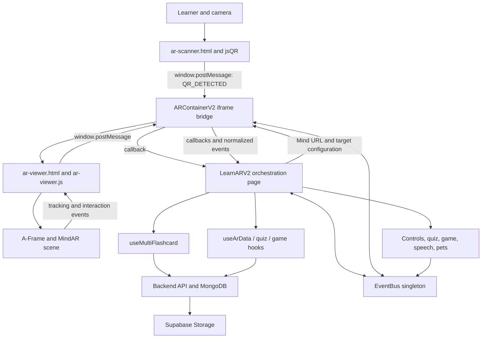
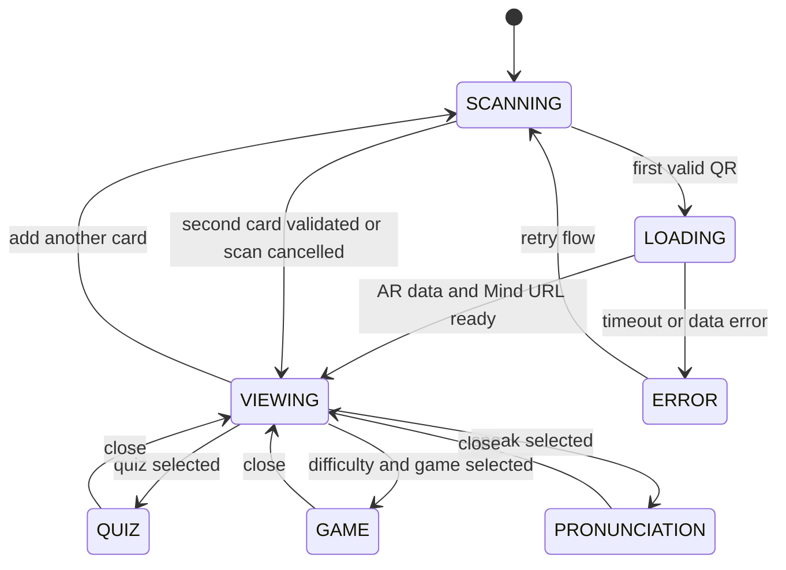
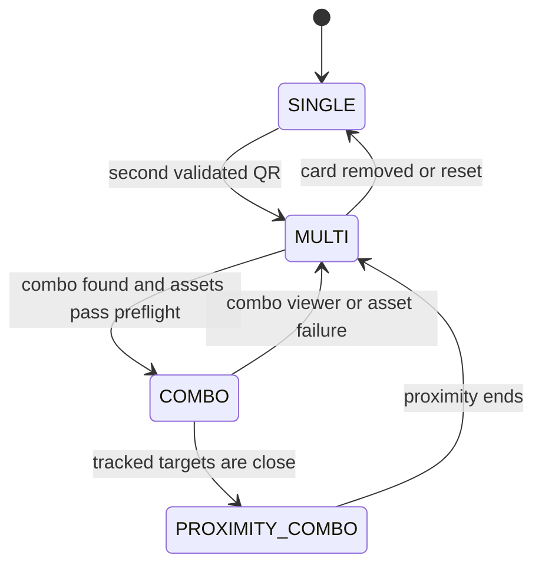
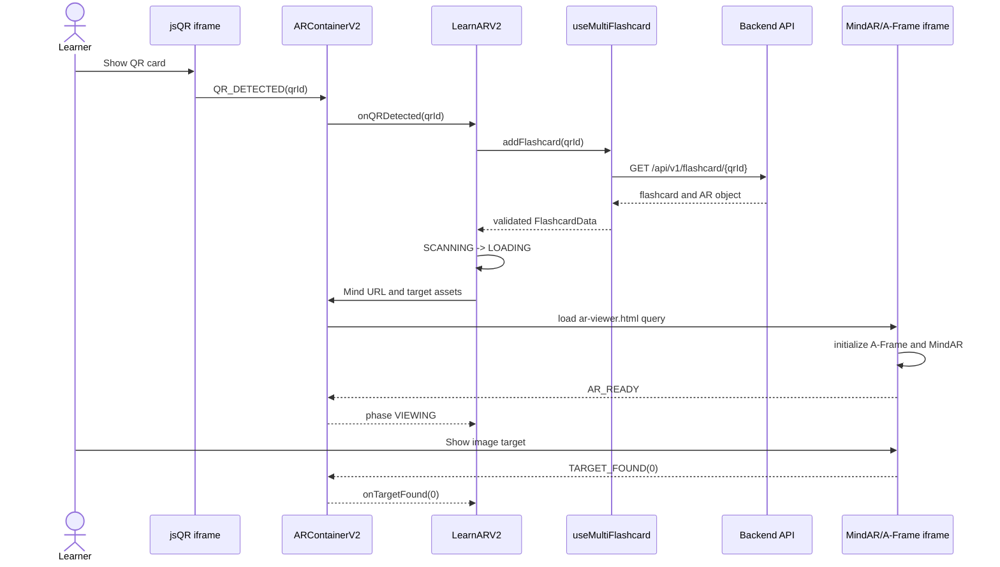
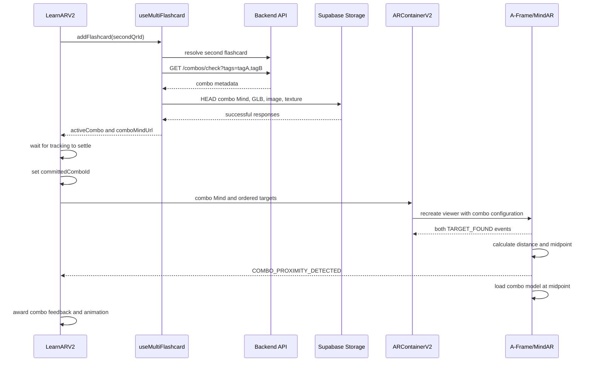

# LearnARV2 Architecture and Data Flow

## Purpose

`LearnARV2.tsx` is the orchestration page for the AR learning experience. It does not render or track AR directly. Instead, it coordinates authentication, QR scanning, backend data, MindAR/A-Frame rendering, multi-card combinations, learning modes, gamification, pets, pronunciation, and session limits.

The implementation behaves like a set of cooperating finite-state machines, although it does not use XState or another formal state-machine library.

## Architecture Overview



## Main Layers

### 1. Product Orchestrator: `LearnARV2.tsx`

Responsibilities:

- Enforces authentication or guest access.
- Owns the learner-facing application state.
- Starts and ends backend learning sessions.
- receives validated QR detections.
- Selects the active Mind file and target assets.
- Coordinates single-card, multi-card, and combo modes.
- Opens quiz, game, pronunciation, pet, and break-reminder overlays.
- Translates low-level AR events into learning actions, XP, audio, haptics, and UI state.
- Emits structured `AR_DEBUG` messages for the mobile debug panel.

### 2. AR Runtime Bridge: `ARContainerV2.tsx`

`ARContainerV2` separates React from the camera runtime. It swaps the main iframe based on its phase:

- `SCANNING` loads `/ar-scanner.html`.
- `LOADING` temporarily renders no camera iframe while configuration resolves.
- `VIEWING` loads `/ar-viewer.html?...` with the selected Mind and asset URLs.
- `ERROR` renders the error state.

It also:

- Builds the viewer query string.
- Normalizes legacy AR asset URLs.
- Converts legacy iframe messages into the typed `ARMessage` format.
- Routes child events to React callbacks and the global `EventBus`.
- Routes React commands back to the active iframe.
- Keeps callback refs fresh without rebuilding the global message listener.

### 3. Scanner Runtime

`ar-scanner.html` uses `jsQR` over a camera video/canvas stream. On a successful QR read, its JavaScript sends `QR_DETECTED` to the React parent through `window.postMessage`.

The scanner identifies the database record. It does not perform image-target tracking.

### 4. AR Viewer Runtime

`ar-viewer.html` creates an A-Frame scene configured with MindAR Image Tracking:

```text
<a-scene mindar-image="imageTargetSrc: ...; maxTrack: ...">
```

`ar-viewer.js` then:

- Reads Mind, model, image, texture, word, and combo values from URL parameters.
- Creates and configures A-Frame entities for up to five targets.
- Handles MindAR `targetFound` and `targetLost` events.
- Switches entities between 2D and 3D display modes.
- Detects simultaneous targets and their spatial proximity.
- Creates combo effects and positions the combo model at the target midpoint.
- Restores original models when combo loading fails or proximity ends.
- Sends tracking, interaction, error, debug, and render-snapshot messages to React.

### 5. Multi-Flashcard Domain State: `useMultiFlashcard.ts`

The hook owns a separate state machine for discovered cards:

```text
SINGLE -> MULTI -> COMBO -> PROXIMITY_COMBO
```

It stores cards in `Map<qrId, FlashcardData>`, preserving scan order while allowing direct duplicate checks.

When at least two cards are present, it:

1. Collects their `arTag` values.
2. Calls `/api/v1/combos/check?tags=...`.
3. Normalizes combo asset URLs.
4. Performs `HEAD` preflight checks for the combo Mind, GLB, image, and optional texture.
5. Commits the combo only if all required assets are reachable.
6. Preserves the individual target configuration if lookup or asset validation fails.

## State Machines

### Learner Application State

Defined in `LearnARV2.tsx`:

```ts
type AppState =
  | 'SCANNING'
  | 'LOADING'
  | 'VIEWING'
  | 'QUIZ'
  | 'GAME'
  | 'PRONUNCIATION'
  | 'ERROR';
```



### AR Container Phase

Defined independently in `ARContainerV2.tsx`:

```ts
type ARPhase =
  | 'IDLE'
  | 'SCANNING'
  | 'LOADING'
  | 'VIEWING'
  | 'ERROR'
  | 'GAME_DRAG'
  | 'GAME_MEMORY'
  | 'GAME_COLORING';
```

The active implementation mainly uses `SCANNING`, `LOADING`, `VIEWING`, and `ERROR`. `LearnARV2` mirrors relevant phase changes into `AppState`, but the two state types are not the same machine.

### Multi-Card State



`committedComboId` adds a two-phase commit at the page level. Finding a combo does not immediately swap the iframe. The page waits at least 700 ms and requires 900 ms without a recent target event before selecting the combo Mind file. This avoids replacing the viewer in the middle of an active tracking transition.

Independent dual-card rendering uses the same settle rule through `committedMultiKey`. A keyed combo resolution (`idle`, `checking`, `found`, `not_found`, `rejected`, or `error`) prevents repeated lookups and starts independent preparation only after combo resolution reaches a terminal non-combo result.

## Event Architecture

There are three event channels.

### Channel A: iframe `window.postMessage`

Used across the React/iframe boundary.

Child-to-parent events include:

- `QR_DETECTED`
- `AR_READY`
- `TARGET_FOUND`
- `TARGET_LOST`
- `MULTI_TARGET_DETECTED`
- `COMBO_DETECTED`
- `MODEL_CLICKED`
- `SYSTEM_ERROR` / `AR_ERROR`
- `COMBO_PROXIMITY_DETECTED`
- `COMBO_PROXIMITY_UPDATE`
- `COMBO_PROXIMITY_ENDED`
- `AR_DEBUG`

Parent-to-child commands include:

- `SET_MODE`
- `TRIGGER_ANIMATION`
- `UPDATE_TEXTURE`
- `PLAY_AUDIO`
- `PAUSE_TRACKING`
- `RESUME_TRACKING`
- `LOAD_MODEL`
- `INITIAL_STATE`

`normalizeMessage()` supports both the current typed envelope and the older flat message format.

### Channel B: Global React `EventBus`

`EventBus` is a singleton in-memory pub/sub service. It decouples controls and page logic from `ARContainerV2`.

Important commands:

- `AR_SWITCH_TO_VIEWER`
- `AR_SWITCH_TO_SCANNER`
- `AR_SET_MODE`
- `AR_COMMAND`
- `AR_RESUME_SCAN`
- `PET_CHAT_OPEN`

Important normalized domain events:

- `SCENE_READY`
- `MARKER_FOUND`
- `MARKER_LOST`
- `COMBO_ACTIVATED`
- `AR_ERROR`

### Channel C: Direct React Callbacks

`ARContainerV2` calls page handlers for high-value events:

- `onQRDetected`
- `onTargetFound`
- `onTargetLost`
- `onModelClick`
- `onComboDetected`
- `onViewerAssetError`
- `onPhaseChange`

Callbacks are stored in a ref inside the container so message handling sees current behavior without repeatedly detaching and attaching listeners.

## Single-Card Data Flow



## Multi-Card and Combo Data Flow



The combo target order comes from `activeCombo.requiredTags`, not QR scan order. `getFlashcardByTag()` maps each required tag back to its scanned card, making elephant-then-palm and palm-then-elephant equivalent.

### Independent Multi Target Preparation

When no usable combo exists, `LearnARV2` fetches both single-target MindAR v2 files, validates that each contains exactly one target, and merges their MessagePack `dataList` entries in QR scan order. The page retains the first-card viewer while this work runs.

The merged bytes cannot be exposed as a Blob URL created by the React parent because browser iframe isolation prevents MindAR from fetching that URL reliably. Instead:

1. React commits the merged `Uint8Array` after asset preflight and tracking settle time.
2. `ARContainerV2` opens the viewer with `mind=runtime-buffer`.
3. The viewer bootstrap emits `MIND_BUFFER_REQUEST`.
4. `ARContainerV2` replies with `MIND_BUFFER` and the merged bytes.
5. The iframe creates its own Blob URL, configures MindAR, and then initializes A-Frame.
6. The iframe revokes its Blob URL during unload.

This preserves deterministic mapping: merged target index 0 uses the first scanned card's assets, and index 1 uses the second scanned card's assets. A stale operation ID and `AbortController` prevent an old card pair from replacing a newer viewer.

## Failure and Rollback Flow

Combo activation is intentionally defensive:

1. Failed combo lookup leaves the individual cards untouched.
2. Failed asset preflight rejects the combo before iframe replacement.
3. A combo model load error inside A-Frame shows the combo image fallback when possible.
4. If no combo fallback is available, `ar-viewer.js` restores both original model entities.
5. A runtime combo viewer error reaches `onViewerAssetError`.
6. `LearnARV2` clears `committedComboId` and calls `rejectCombo()`.
7. The page derives its viewer props from the original scanned targets again.

Relevant mobile debug labels include:

- `FLASHCARD_RESOLVED`
- `COMBO_LOOKUP_STARTED`
- `COMBO_ASSET_PROBE`
- `COMBO_ASSETS_READY`
- `COMBO_REJECTED_ORIGINALS_PRESERVED`
- `LEARNAR_VIEWER_INPUTS`
- `COMBO_VIEWER_FAILED_RESTORING_ORIGINALS`
- `COMBO_ROLLBACK_ORIGINALS_PRESERVED`
- `COMBO_RESOLUTION_CHANGED`
- `MULTI_MIND_PREPARE_STARTED`
- `MULTI_MIND_SOURCE_LOADED`
- `MULTI_MIND_VALIDATED`
- `MULTI_MIND_MERGED`
- `MULTI_MIND_BLOB_CREATED`
- `MULTI_VIEWER_COMMITTED`
- `MULTI_TARGET_1_FIRST_FOUND`
- `MULTI_MIND_PREPARE_FAILED`
- `MULTI_MIND_OPERATION_STALE`
- `MULTI_MIND_BLOB_REVOKED`

## Backend Data Contracts

### Flashcard Resolution

```text
GET /api/v1/flashcard/{qr_id}
```

The response supplies:

- `flashcard.qr_id`
- `flashcard.ar_tag`
- `target.ar_tag`
- `target.model_3d_url`
- `target.image_2d_url`
- `target.texture_url`
- `target.nft_base_url`

MongoDB and API fields remain snake_case. The hook maps them to camelCase TypeScript values only after receiving the response.

### Combo Resolution

```text
GET /api/v1/combos/check?tags={tag1},{tag2}
```

The combo contract includes:

- `combo_id`
- `required_tags`
- `model_3d_url`
- `image_2d_url`
- `texture_url`
- `combo_mind_url`
- `bonus_xp`

### Session Lifecycle

Authenticated learners start a session on mount and end it during exit or unmount:

```text
POST  /api/v1/sessions/start
PATCH /api/v1/sessions/{sessionId}/end
```

Guest sessions remain read-only and do not create backend session records.

## Other Learning Flows

- **3D/2D mode:** `ARControlPanel` emits a display-mode change; the page publishes `AR_SET_MODE`; the container forwards `SET_MODE` to the viewer.
- **Model tap:** `MODEL_CLICKED` reaches `handleModelClick`, which plays recorded audio or browser speech and emits `TRIGGER_ANIMATION`.
- **Quiz:** selecting quiz changes `AppState` to `QUIZ` and renders the lazy `QuizOverlay`.
- **Game:** difficulty and game type are selected before changing `AppState` to `GAME`.
- **Pronunciation:** `PRONUNCIATION` uses browser speech recognition, local scoring, AI feedback, and optional backend attempt logging.
- **Break management:** `useSessionTimer` opens a reminder at 25 minutes and enforces the 30-minute limit policy.

## Important Implementation Notes

- This is a distributed state-machine architecture, not one centralized formal machine.
- React owns product state; MindAR owns tracking state; A-Frame owns scene/entity state.
- iframe replacement is a meaningful lifecycle boundary: the camera/scene runtime is recreated when its source changes.
- `window.postMessage('*')` and legacy message compatibility are convenient but weaken origin guarantees. A future hardening pass should validate `event.origin` and `event.source` for every accepted message.
- `AREventPayloadMap` and some `as any` emissions are not fully aligned. The runtime works, but stronger event typing would reduce contract drift.
- `LearnARV2` and `ARContainerV2` both maintain related phase state. A future formal state machine could make synchronization and impossible-state prevention clearer.

## Source Map

- `frontend-web/src/pages/LearnARV2.tsx`: product orchestration and learner state.
- `frontend-web/src/components/ar/ARContainerV2.tsx`: iframe lifecycle and message bridge.
- `frontend-web/src/hooks/useMultiFlashcard.ts`: card registry, combo lookup, preflight, and rollback.
- `frontend-web/src/runtime/EventBus.ts`: in-memory React event bus.
- `frontend-web/src/core/types/ARMessages.ts`: typed iframe protocol.
- `frontend-web/src/core/types/AREvents.ts`: domain event constants and payload types.
- `frontend-web/public/ar-scanner.html`: jsQR camera shell.
- `frontend-web/public/static/ar-assets/js/ar-scanner.js`: scanner behavior.
- `frontend-web/public/ar-viewer.html`: A-Frame/MindAR scene shell.
- `frontend-web/public/static/ar-assets/js/ar-viewer.js`: targets, models, proximity, combo effects, and fallbacks.
