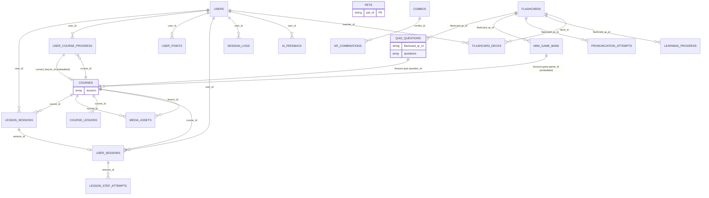

# MongoDB Reference Map

**Generated:** 2026-07-23 04:03:42 UTC

This document shows inferred relationships between collections based on
field naming conventions and ObjectId patterns.

## Relationship Summary

| Source Collection | Field | Target Collection | Confidence | Rationale |
|------------------|-------|------------------|------------|-----------|
| `lesson_sessions` | `user_id` | `users` | high | `_id` field in users, high-confidence match |
| `lesson_sessions` | `course_id` | `courses` | high | `course_id` unique index in courses |
| `lesson_sessions` | `lesson_id` | `courses` (embedded) | medium | lesson embedded in courses |
| `lesson_sessions` | `session_id` | `user_sessions` | high | `session_id` indexed in user_sessions |
| `lesson_sessions` | `steps.step_id` | `courses` (embedded) | medium | steps embedded in lesson_sessions |
| `user_course_progress` | `user_id` | `users` | high | `email`/`username` unique indexes in users |
| `user_course_progress` | `course_id` | `courses` | high | `course_id_unique` index in courses |
| `user_course_progress` | `lesson_progress.lesson_id` | `courses` (embedded) | medium | lesson embedded in courses |
| `ai_feedback` | `user_id` | `users` | high | `email`/`username` unique indexes in users |
| `user_points` | `user_id` | `users` | high | `email`/`username` unique indexes in users |
| `session_logs` | `user_id` | `users` | high | `email`/`username` unique indexes in users |
| `pets` | `pet_id` | `pets` | high | `pet_id` unique index in pets |
| `combos` | `combo_id` | `combos` | high | `combo_id` unique index in combos |
| `ar_combinations` | `combo_id` | `combos` | high | `combo_id` unique index in combos |
| `flashcards` | `qr_id` | `flashcards` | medium | `qr_id` unique index in flashcards |
| `flashcard_decks` | `deck_id` | `courses` (embedded) | medium | decks embedded in courses |
| `flashcard_decks` | `teacher_id` | `users` | medium | teacher is a user |
| `quiz_questions` | `flashcard_qr_id` | `flashcards` | medium | `qr_id` unique index in flashcards |
| `mini_game_bank` | `flashcard_qr_id` | `flashcards` | medium | `qr_id` unique index in flashcards |
| `media_assets` | `course_id` | `courses` | high | `course_id_unique` index in courses |
| `media_assets` | `lesson_id` | `courses` (embedded) | medium | lesson embedded in courses |
| `media_assets` | `section_id` | `courses` (embedded) | medium | section embedded in lessons |
| `courses` | `lessons.lesson_id` | `courses` (self-ref) | high | lessons are embedded in courses |
| `courses` | `lessons.game.game_id` | `mini_game_bank` | medium | game_id in mini_game_bank |
| `courses` | `lessons.pronunciation.task_id` | `pronunciation_attempts` | medium | task_id in pronunciation_attempts |
| `courses` | `lessons.quiz.question_id` | `quiz_questions` | medium | quiz questions are top-level |
| `courses` | `lessons.quiz.options.option_id` | `quiz_questions` | medium | options embedded in quiz_questions |

## Mermaid ER Diagram

Based on high-confidence relationship inferences:

## Key Findings

1. **User-centric relationships**: `users` is the central entity, referenced by 7+ collections (`user_id`)
2. **Course as content hub**: `courses` embeds lessons directly (no separate `lessons` collection needed), referenced by `user_course_progress`, `media_assets`, `lesson_sessions`
3. **Duplicate databases**: `edu_platform` and `eduplatform` have identical collection names — this appears to be a staging/production split or migration artifact
4. **TTL indexes present**: `session_logs` (30 days), `pronunciation_attempts` (90 days), `quiz_attempts` (90 days) — data lifecycle is managed
5. **`courses.lessons` is a rich embedded document** with nested sub-collections (vocabulary, quiz, video, game, pronunciation, etc.) — not normalized

## Verified Cross-References

These field-to-collection relationships are confirmed by the presence of matching unique/indexed fields:

- `lesson_sessions.user_id` → `users.email` (indexed)
- `lesson_sessions.course_id` → `courses.course_id_unique` (indexed)
- `user_course_progress.user_id` → `users.email` (indexed)
- `user_course_progress.course_id` → `courses.course_id_unique` (indexed)
- `pets.pet_id` → `pets.pet_id_1` (unique index)
- `combos.combo_id` → `combos.combo_id_1` (unique index)
- `ar_combinations.combo_id` → `combos.combo_id_1` (unique index)
- `flashcards.qr_id` → `flashcards.qr_id_1` (unique index)
- `media_assets.course_id` → `courses.course_id_unique` (indexed)
